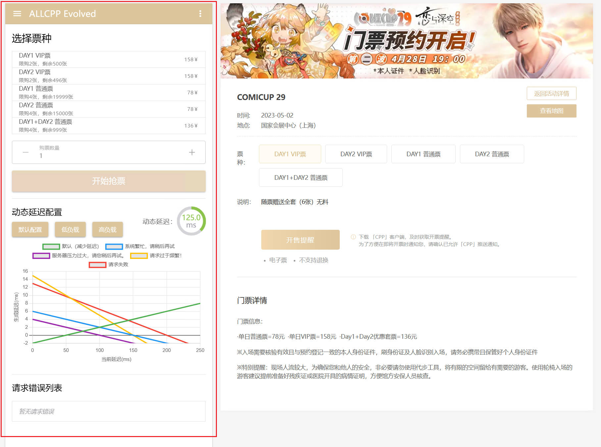
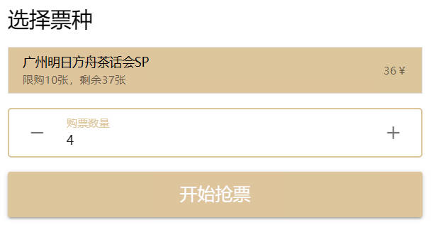
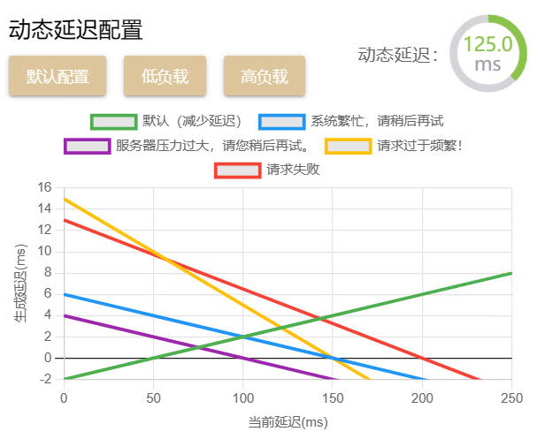
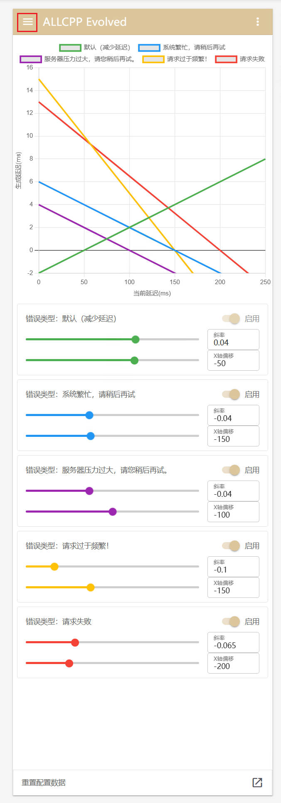

# 「 无差别同人站（ALLCPP）增强脚本 」

[](https://github.com/STEA-TEAM/allcpp-evolved/actions/workflows/main.yml)  

[📦 安装](#安装)

[📚 功能](#功能)

[👻 兼容性](#兼容性)

[📝 开发](#开发)

# 安装

需要浏览器装有 [Tampermonkey](https://tampermonkey.net/) 或 [Violentmonkey](https://violentmonkey.github.io/) 插件,
下方表格中挑一个链接安装.

**注意事项**

- **⚠ 使用正式版 (GitHub 源) 须翻墙.**
- 对性能有影响.
- 默认不对未登录的状态做适配.
- 新版本一旦正式发布, 就不再对旧版本做任何技术支持.
- 使用外部网站的链接时 (如将下载任务发送到自己的服务器 / 使用链接安装组件等) 可能会提示"脚本试图访问跨域资源", 请选择"
  始终允许".
- 需要在至少 1400 x 800 以上的逻辑分辨率下使用.

| 正式版 (GhProxy 加速)                                                                                                      | 正式版 (GitHub 源)                                                                                    |
|-----------------------------------------------------------------------------------------------------------------------|---------------------------------------------------------------------------------------------------|
| [安装](https://ghproxy.com/https://github.com/STEA-TEAM/allcpp-evolved/releases/latest/download/allcpp-evolved.user.js) | [安装](https://github.com/STEA-TEAM/allcpp-evolved/releases/latest/download/allcpp-evolved.user.js) |

# 功能

## 主面板

脚本启用后, 在【活动详情】网页左侧会有一个功能面板，右侧的购票须知会被移除。



### 选票板块

选票板块会在主面板加载完毕后自动读取当前活动的门票信息，选中票种会自动判断是否需要验证购票人，并改变“购票数量”输入框样式。




### 动态延迟配置板块

动态延迟配置板块在抢票时会根据返回的错误信息动态修改请求延迟，脚本内置了三套针对不同服务器负载情况的延迟配置，可以在此板块中修改。



### 错误列表板块

错误列表板块在抢票时会统计返回的错误信息。


## 抽屉面板

点击主面板顶栏左上角的汉堡按钮可打开抽屉面板，在面板中可以详细调整各个错误信息对应的动态延迟函数参数。



# 兼容性

## 脚本管理器

### [Tampermonkey](https://tampermonkey.net/) / [Violentmonkey](https://violentmonkey.github.io/)

兼容, 但在较旧的浏览器中 Violentmonkey 可能无法运行此脚本.

### [Greasemonkey](https://www.greasespot.net/)

不兼容.

### [AdGuard](https://adguard.com/zh_cn/adguard-windows/overview.html)

未测试.

# 开发

### 克隆并安装依赖

```bash
git clone https://github.com/STEA-TEAM/allcpp-evolved.git
cd allcpp-evolved
pnpm install
```

### Dev（热更新）

```bash
pnpm run dev
# 在tampermonkey面板中新建一个脚本，将控制台输出的内容或`./dist/main.user.dev.js`的内容复制进去保存
# 代码热更新后刷新浏览器页面即可看到更改
```

### Build

```bash
pnpm run build
# 将`./dist/main.user.js`的内容发布即可
```
